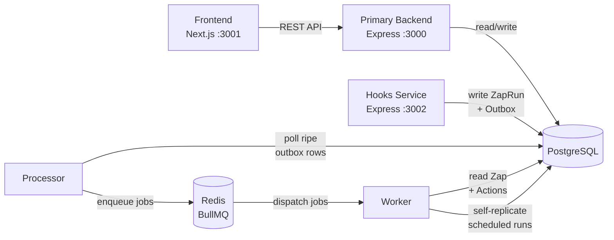
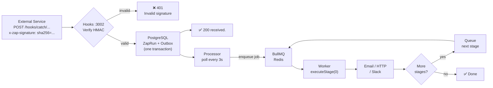
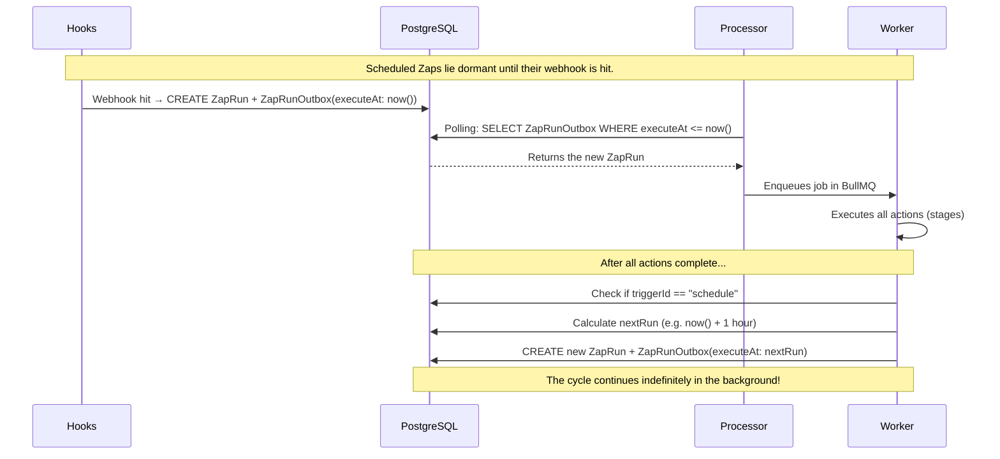
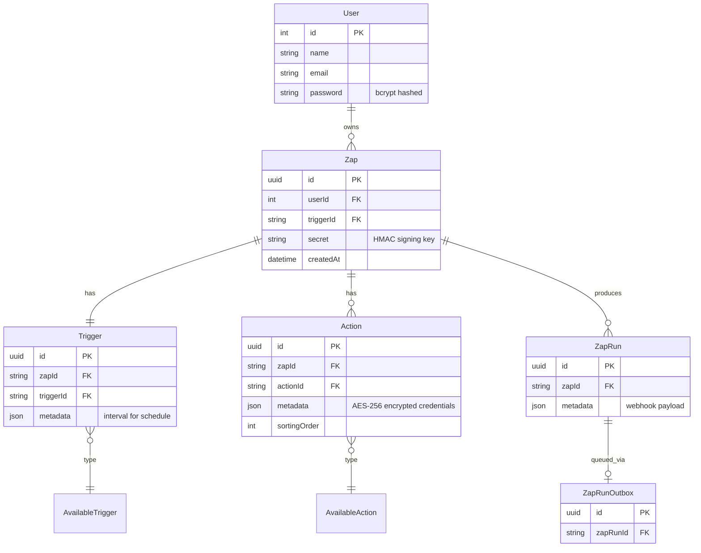

# ⚡ Zap

A production-grade Zapier-like workflow automation platform. Users create **Zaps** — a trigger paired with one or more actions that execute automatically in sequence whenever the trigger fires.

**Triggers:** Webhook · GitHub Push · Schedule (cron)
**Actions:** Send Email · HTTP Request · Slack Message

---

## Architecture

### Services Overview



---

### Webhook Flow



---

### Schedule Trigger Flow (Activator Hook / Self-Replicating Outbox)



---

## Data Model



---

## Services

| Service | Port | Role |
|---------|------|------|
| `primary-backend` | 3000 | REST API — users, zaps, triggers, actions |
| `hooks` | 3002 | Receives webhooks, verifies HMAC, writes outbox |
| `processor` | — | Polls ripe outbox items every 3s, pushes to BullMQ |
| `worker` | — | Executes actions (concurrency 5) + self-replicates schedules |
| `frontend` | 3001 | Next.js UI |

---

## Stack

- **Backend** — Node.js, Express, TypeScript
- **Database** — PostgreSQL + Prisma ORM
- **Queue** — Originally Apache Kafka (KafkaJS). Production uses BullMQ + Redis. Architecture is queue-agnostic by design via the transactional outbox pattern.
- **Frontend** — Next.js, Tailwind CSS
- **Security** — bcrypt password hashing · HMAC-SHA256 webhook verification · AES-256-GCM credential encryption · JWT (Bearer, 7d expiry)

---

## Running Locally

Only requires Docker Desktop.

```bash
# First time or after code changes
docker compose up --build

# Start without rebuilding
docker compose up

# Stop (keeps data)
docker compose down

# Stop and wipe all data
docker compose down -v

# Logs for a specific service
docker compose logs -f worker
```

- API → `http://localhost:3000`
- Hooks → `http://localhost:3002`
- Frontend → `http://localhost:3001`

---

## Environment Variables

| Variable | Service | Description |
|----------|---------|-------------|
| `JWT_SECRET` | primary-backend | JWT signing secret |
| `ENCRYPTION_KEY` | primary-backend, worker | 32-char AES-256 key for stored credentials |
| `DATABASE_URL` | all | PostgreSQL connection string |
| `REDIS_HOST` | processor, worker | Redis hostname |
| `REDIS_PORT` | processor, worker | Redis port (default 6379) |
| `EMAIL_USER` | worker | Fallback Gmail address (optional) |
| `EMAIL_PASS` | worker | Fallback Gmail app password (optional) |

---

## Calling a Webhook

```ts
const payload = JSON.stringify({ comment: { email: "user@example.com", text: "Hello" } });

const signature = "sha256=" + crypto
  .createHmac("sha256", zapSecret)
  .update(Buffer.from(payload))
  .digest("hex");

fetch("http://localhost:3002/hooks/catch/<userId>/<zapId>", {
  method: "POST",
  headers: {
    "Content-Type": "application/json",
    "x-zap-signature": signature,
  },
  body: payload,
});
```

GitHub webhooks are supported natively — paste your webhook URL into repo Settings → Webhooks and set the secret. GitHub sends `x-hub-signature-256` which the hooks service accepts automatically.

---

## Dynamic Values in Actions

Use `{field}` or `{nested.field}` in action body/message to inject webhook payload values:

```
Webhook body:  { "comment": { "email": "user@example.com", "text": "Hello" } }
Action body:   "Message from {comment.email}: {comment.text}"
Resolved:      "Message from user@example.com: Hello"
```

For scheduled zaps — resolved values from the first webhook run are saved back to the action and reused on every subsequent scheduled execution.

---

## Adding a New Action

1. Add to `primary-backend/src/seed.ts`
2. Add config form in `frontend/app/zap/create/page.tsx`
3. Handle `action.type.id` in `worker/src/index.ts`

## Adding a New Trigger

1. Add to `primary-backend/src/seed.ts`
2. If needs config, add to `TRIGGERS_WITH_CONFIG` and add a selector component in the create page
